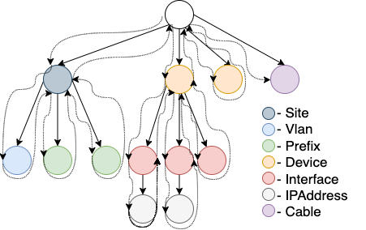

To be able to properly compare different datasets, DiffSync relies on a shared data model that both systems must use.
Specifically, each system or dataset must provide a `DiffSync` "adapter" subclass, which in turn represents its dataset as instances of one or more `DiffSyncModel` data model classes.

When comparing two systems, DiffSync detects the intersection between the two systems (which data models they have in common, and which attributes are shared between each pair of data models) and uses this intersection to compare and/or synchronize the data.

# Define your model with DiffSyncModel

`DiffSyncModel` is based on [Pydantic](https://pydantic-docs.helpmanual.io/) and is using Python typing to define the format of each attribute.
Each `DiffSyncModel` subclass supports the following class-level attributes:

- `_modelname` - Defines the type of the model; used to identify common models between different systems (Mandatory)
- `_identifiers` - List of instance field names used as primary keys for this object (Mandatory)
- `_shortname` - List of instance field names to use for a shorter name (Optional)
- `_attributes` - List of non-identifier instance field names for this object; used to identify the fields in common between data models for different systems (Optional)
- `_children` - Dict of `{<model_name>: <field_name>}` indicating which fields store references to child data model instances. (Optional)

> DiffSyncModel instances must be uniquely identified by their unique ID (or, in database terminology, [natural key](https://en.wikipedia.org/wiki/Natural_key)), which is composed of the union of all fields defined in `_identifiers`. The unique ID must be globally meaningful (such as an unique instance name or slug), as it is used to identify object correspondence between differing systems or data sets. It **must not** be a value that is only locally meaningful to a specific data set, such as a database primary key value.

> Only fields listed in `_identifiers`, `_attributes`, or `_children` will be potentially included in comparison and synchronization between systems or data sets. Any other fields will be ignored; this allows for a model to additionally contain fields that are only locally relevant (such as database primary key values) and therefore are irrelevant to comparison and synchronization.

```python
from typing import List, Optional
from diffsync import DiffSyncModel

class Site(DiffSyncModel):
    _modelname = "site"
    _identifiers = ("name",)
    _shortname = ()
    _attributes = ("contact_phone",)
    _children = {"device": "devices"}

    name: str
    contact_phone: Optional[str]
    devices: List = list()
    database_pk: Optional[int]  # not listed in _identifiers/_attributes/_children as it's only locally significant
```

## Relationship between models

Currently the relationships between models are very loose by design. Instead of storing an object, it's recommended to store the unique id of an object and retrieve it from the store as needed. The `add_child()` API of `DiffSyncModel` provides this behavior as a default.

# Define your system adapter with DiffSync

A `DiffSync` "adapter" subclass must reference each model available at the top of the object by its modelname and must have a `top_level` attribute defined to indicate how the diff and the synchronization should be done. In the example below, `"site"` is the only top level object so the synchronization engine will only check all known `Site` instances and all children of each Site. In this case, as shown in the code above, `Device`s are children of `Site`s, so this is exactly the intended logic.

```python
from diffsync import DiffSync

class BackendA(DiffSync):

    site = Site
    device = Device

    top_level = ["site"]
```

It's up to the implementer to populate the `DiffSync`'s internal cache with the appropriate data. In the example below we are using the `load()` method to populate the cache but it's not mandatory, it could be done differently.

## Model Processing Ordering Logic

The models will be processed in a specfic order as defined by `top_level` atttribute on the `DiffSync` object and then the `_children` attribute on the `DiffSyncModel`. The processing algorithm is technically a "Preorder Tree Traversal", which means that "a parent node is processed before any of its child nodes is done." This can be described as:

- Start with the first element of the first model in `top_level` and process it.
- If that model has `_children` set on it, for each child of each child model, in order:
    - Process that child element.
    - If the child has has `_children` of its own, process its children, and so on until the complete end of lineage (e.g. children, children of children, etc.)
    - Proceed to the next child element, or to the next model in `_children` if done with all elements of that model.
- Repeat for the next element of the top-level model, until done with all elements of that model.
- Continue to the first element of the next model in the `top_level` attribute, and repeat the process, and so on.

Given the following Scenario:

```python

class Site(DiffSyncModel):
    _children = {"vlan": "vlans", "prefix": "prefixes"}
    [...]

class Device(DiffSyncModel):
    _children = {"interface": "interfaces"}
    [...]

class Vlan(DiffSyncModel):
    [...]

class Prefix(DiffSyncModel):
    [...]

class Interface(DiffSyncModel):
    _children = {"ip_address": "ip_addresses"}
    [...]

class IPAddress(DiffSyncModel):
    [...]

class Cable(DiffSyncModel):
    [...]


class Nautobot(DiffSync):
    site = Site
    device = Device
    interface = Interface
    ip_address = IPAddress
    cable = Cable
    vlan = Vlan
    prefix = Prefix

    top_level = ["site", "device", "cable"]
    [...]

```

Would result in processing in the following order for each element until there is no elements left:

- site
    - vlan
    - prefix
- device
    - interface
        - ip_address
- cable

> Note: This applies to the actual diff sync (`Diffsync.sync_from/Diffsync.sync_to`), and not the loading of the data (`Diffsync.load`), which is up to the developer to determine the order.

This can be visualized here in the included diagram.



# Store data in a `DiffSync` object

To add a site to the local cache/store, you need to pass a valid `DiffSyncModel` object to the `add()` function.

```python
class BackendA(DiffSync):
    [...]

    def load(self):
        # Store an individual object
        site = self.site(name="nyc")
        self.add(site)

        # Store an object and define it as a child of another object
        device = self.device(name="rtr-nyc", role="router", site_name="nyc")
        self.add(device)
        site.add_child(device)
        site.update()
```

# Update remote system on sync

When data synchronization is performed via `sync_from()` or `sync_to()`, DiffSync automatically updates the in-memory
`DiffSyncModel` objects of the receiving adapter. The implementer of this class is responsible for ensuring that any remote system or data store is updated correspondingly. There are two usual ways to do this, depending on whether it's more
convenient to manage individual records (as in a database) or modify the entire data store in one pass (as in a file-based data store).

## Manage individual records

To update individual records in a remote system, you need to extend your `DiffSyncModel` class(es) to define your own `create`, `update` and/or `delete` methods for each model.
A `DiffSyncModel` instance stores a reference to its parent `DiffSync` adapter instance in case you need to use it to look up other model instances from the `DiffSync`'s cache.

```python
class Device(DiffSyncModel):
    [...]

    @classmethod
    def create(cls, diffsync, ids, attrs):
        ## TODO add your own logic here to create the device on the remote system
        # Call the super().create() method to create the in-memory DiffSyncModel instance
        return super().create(ids=ids, diffsync=diffsync, attrs=attrs)

    def update(self, attrs):
        ## TODO add your own logic here to update the device on the remote system
        # Call the super().update() method to update the in-memory DiffSyncModel instance
        return super().update(attrs)

    def delete(self):
        ## TODO add your own logic here to delete the device on the remote system
        # Call the super().delete() method to remove the DiffSyncModel instance from its parent DiffSync adapter
        super().delete()
        return self
```

## Bulk/batch modifications

If you prefer to update the entire remote system with the final state after performing all individual create/update/delete operations (as might be the case if your "remote system" is a single YAML or JSON file), the easiest place to implement this logic is in the `sync_complete()` callback method that is automatically invoked by DiffSync upon completion of a sync operation.

```python
class BackendA(DiffSync):
    [...]

    def sync_complete(self, source: DiffSync, diff: Diff, flags: DiffSyncFlags, logger: structlog.BoundLogger):
        ## TODO add your own logic to update the remote system now.
        # The various parameters passed to this method are for your convenience in implementing more complex logic, and
        # can be ignored if you do not need them.
        #
        # The default DiffSync.sync_complete() method does nothing, but it's always a good habit to call super():
        super().sync_complete(source, diff, flags, logger)
```
